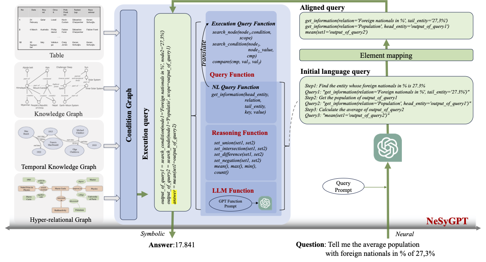

# CCKS2024——人物知识图谱复杂问答推理评测 baseline

## 🌈 Model Architecture



## 📕 Dependencies

```bash
pip install -r requirements.txt
```

## 💡 **Quick start**

NOTE: 
1. Please write the API key in `api_key.txt` before running the code. And the number of keys in `api_key.txt` should be equal to `num_process`.
2. Replace the `openai_url` in `scripts/ccks_round1.sh` as needed.
3. `Get_ccks_demo.py` uses knn to find representative questions and construct demostrations for `structllm/prompt_/ccks_round1.json`.

```bash
>> bash scripts/ccks_round1.sh
```

## 📚 Code path

The file submited to TianChi is `output\ccks_round1\TeamName_result.txt`, remember to replace the `TeamName` with true team name.